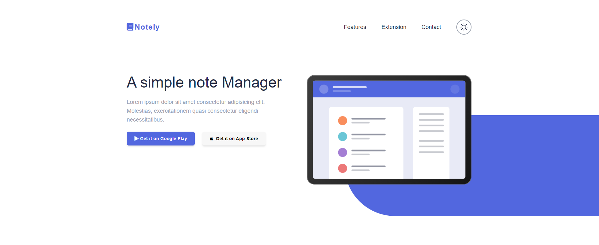
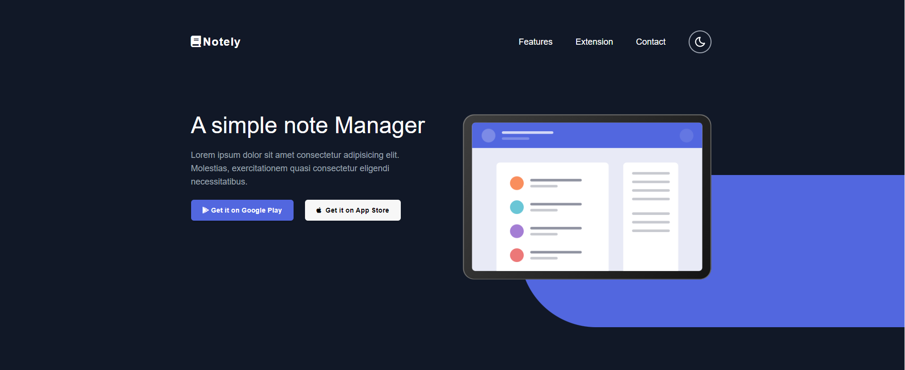

# Notely Website

The Notely Website is a simple, mobile-responsive website built with HTML5, Tailwind CSS, and JavaScript. It is inspired by a YouTube tutorial and includes additional features like dark mode and additional icons using Font Awesome.

## Features

- **Dark Mode**: Toggle between light and dark mode for comfortable reading.
- **Mobile-Responsive**: The website is designed to appear decent on both desktop and mobile devices.
- **Additional Icons**: Font Awesome icons are used to enhance the visual experience.

## Technologies Used

- **HTML5**: The structure and content of the app are built using HTML5.
- **Tailwind CSS**: Tailwind CSS is used for styling, providing a responsive and modern design.
- **JavaScript**: JavaScript is used to add interactivity to the app.
- **Font Awesome**: Font Awesome icons are used for additional visual elements.

## Getting Started

There's no need for a complex setup. Just clone the repository, run `npm install` to install the dependencies, open the index.html file in liver server, start development!

## Screenshots

Here are some screenshots of the Notely App in action:

## Contributing

Contributions are welcome! If you'd like to contribute to the Notely App, please follow these steps:

1. Fork the repository.
2. Create a new branch for your feature or bug fix: `git checkout -b feature/my-feature` or `git checkout -b bugfix/issue-number`.
3. Make your changes and commit them.
4. Push your changes to your fork: `git push origin feature/my-feature`.
5. Create a pull request on the main repository.

## License

This project is licensed under the MIT License - see the [LICENSE](LICENSE) file for details.

## Acknowledgments

- Thanks to the YouTube tutorial that inspired this project.
- Font Awesome for providing a rich set of icons.
- The open-source community for their valuable contributions to web development.

Feel free to customize this `README.md` to suit your project's specific details and requirements. Enjoy using the Notely App!
